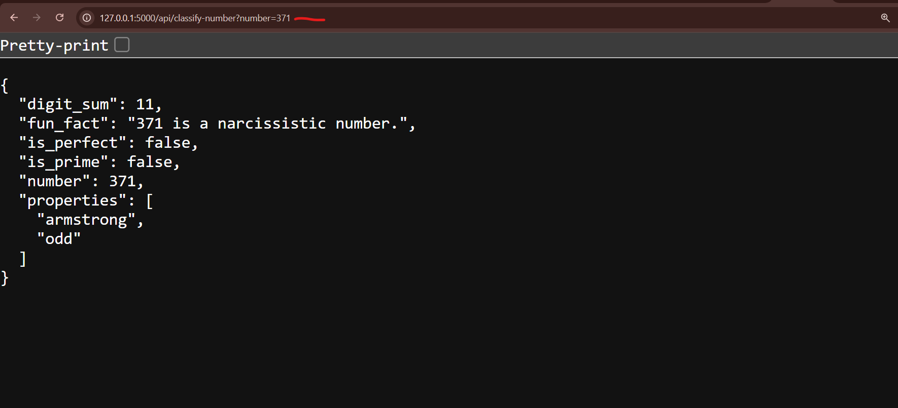
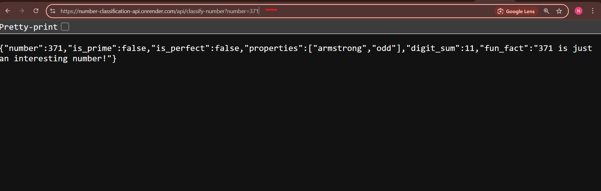

# HNG-Number-classification-API


## Deploying a Number Classification API on Render


### Introduction

I'll walk you through the process of building and deploying a Number Classification API using Flask on Render. I'll also share the challenges I faced during deployment and how I resolved them. 


Technologies Used

- Python
- Flask
- Requests
- Render (Deployment)


__SETTING UP THE PROJECT__

To start, I created a simple Flask API that classifies numbers based on different properties, such as:

- Whether the number is prime

- Whether it is a perfect number

- Whether it is an Armstrong number


__Create a Project Folder__

```
mkdir number-classification-api
cd number-classification-api

```


- Install [Python](https://www.python.org/downloads/) and dependencies

- Create a virtual environment and Install Flask for API development

```
python -m venv venv
venv\Scripts\activate (for windows)
pip install flask requests
```


- Create a Python file `app.py` and add the following code:

```
from flask import Flask, request, jsonify
import requests
import math
import logging
import os

app = Flask(__name__)

# Configure logging
logging.basicConfig(level=logging.INFO)

def is_prime(n):
    """Check if a number is prime."""
    if n < 2:
        return False
    for i in range(2, int(math.sqrt(n)) + 1):
        if n % i == 0:
            return False
    return True

def is_perfect(n):
    """Check if a number is a perfect number (optimized)."""
    if n < 1:
        return False
    divisors = {1}
    for i in range(2, int(math.sqrt(n)) + 1):
        if n % i == 0:
            divisors.add(i)
            divisors.add(n // i)
    return sum(divisors) == n

def is_armstrong(n):
    """Check if a number is an Armstrong number."""
    if n < 0:
        return False  # Armstrong numbers are usually positive
    digits = [int(d) for d in str(n)]
    power = len(digits)
    return sum(d ** power for d in digits) == n

def get_fun_fact(n):
    """Fetch a fun fact from the Numbers API."""
    try:
        response = requests.get(f"http://numbersapi.com/{n}/math?json", timeout=5)
        if response.status_code == 200:
            return response.json().get("text", "No fun fact available")
    except requests.exceptions.RequestException as e:
        logging.error(f"Failed to fetch fun fact for {n}: {e}")
        return "No fun fact available"
    return "No fun fact available"

@app.route('/api/classify-number', methods=['GET'])
def classify_number():
    number_str = request.args.get('number')

    if not number_str:
        return jsonify({"error": "Missing 'number' parameter"}), 400

    try:
        number = int(number_str)
    except (ValueError, TypeError):
        return jsonify({"error": f"Invalid input '{number_str}'. Please provide an integer."}), 400

    properties = []
    if is_armstrong(number):
        properties.append("armstrong")
    properties.append("odd" if number % 2 else "even")

    result = {
        "number": number,
        "is_prime": is_prime(number),
        "is_perfect": is_perfect(number),
        "properties": properties,
        "digit_sum": sum(int(d) for d in str(abs(number))),  # Handle negative numbers
        "fun_fact": get_fun_fact(number)
    }

    return jsonify(result), 200

if __name__ == '__main__':
    debug_mode = os.getenv("FLASK_DEBUG", "false").lower() == "true"
    app.run(debug=debug_mode)
```

- Start the Flask server


`python app.py`


__Pushing to GitHub__

I created and initialized a Git repository and pushed my code to GitHub

`HNG-Number-classification-API`

- Open your terminal or command prompt and navigate to your project folder,Create a `.gitignore` file

```
git init
echo "venv/" >> .gitignore
echo "__pycache__/" >> .gitignore
git add .
git commit -m "Initial commit"
git branch -M main
git remote add origin https://github.com/ogechukwu1/HNG-Number-classification-API.git
git push -u origin main

```


__Preparing for Deployment on Render__

To deploy on [Render](https://dashboard.render.com/), I needed to:

- Create a requirements.txt file with all dependencies

```
blinker==1.9.0
certifi==2025.1.31
charset-normalizer==3.4.1
click==8.1.8
colorama==0.4.6
Flask==3.1.0
idna==3.10
itsdangerous==2.2.0
Jinja2==3.1.5
MarkupSafe==3.0.2
requests==2.32.3
urllib3==2.3.0
Werkzeug==3.1.3
waitress==2.1.2
```

- Click "New Web Service" and connect my GitHub repository

- Select Python as the runtime

- Set the Start Command `waitress-serve --listen=0.0.0.0:10000 app:app`

- Set up Gunicorn or Waitress as the production WSGI server (Web Server Gateway Interface)


Once deployed, you’ll get a public URL like

`http://127.0.0.1:5000/api/classify-number?number=371`





__challenges and Solutions__

__Error 1: Module Not Found Error__

Render was failing to install dependencies, showing this error `ModuleNotFoundError: No module named 'flask'`

__Solution__

I had forgotten to add a requirements.txt file. After adding it and pushing the changes, the error was resolved.


__Error 2: Application Failed to Start__


I got this error when Render tried to run my app: `No module named 'gunicorn'`

__Solution__

Since Render does not run Flask's built-in server in production, I installed waitress and used it instead of Gunicorn `pip install waitress` and updated my start command in Render to `waitress-serve --listen=0.0.0.0:10000 app:app`. Pushed the changes, and the issue was fixed.


__Error 3: API Not Responding__

The API deployed successfully, but requests returned a 404 error.

__Solution__

I realized I had forgotten to expose port 10000 in Render. Went to Render Dashboard → Environment Variables, Set `PORT=10000` and Redeployed the app


__Final Deployment URL__

The API is live at: https://hng-number-classification-api-m4me.onrender.com





__CONCLUSION__

This project has been an incredibly valuable learning experience, and I’m excited with how the Number Classification API has turned out. Building, deploying, and troubleshooting the API has significantly enhanced my skills in both development and deployment. The final result is a fast, reliable, and user friendly API that I’m proud of.
Throughout this journey, I gained hands on experience in deploying APIs, addressing challenges, and optimizing performance skills that are essential in the fields of [DevOps](https://hng.tech/hire/devops-engineers) and [Cloud Engineering](https://hng.tech/hire/cloud-engineers).


After submitting, I encountered the following error, and here's how I resolved it:


__Changes Made__

NGINX Configuration (nginx.conf)

Configured NGINX to proxy requests to the Flask app, which runs on http://127.0.0.1:5000.

The relevant section in nginx.conf:

```
server {
    listen 80;
    server_name localhost;

    location / {
        proxy_pass http://127.0.0.1:5000;
        proxy_set_header Host $host;
        proxy_set_header X-Real-IP $remote_addr;
        proxy_set_header X-Forwarded-For $proxy_add_x_forwarded_for;
        proxy_set_header X-Forwarded-Proto $scheme;
    }
}

```


__Dockerfile__

I Updated the Dockerfile to install both NGINX and Flask in a single container.

The Dockerfile installs the necessary dependencies and configures both Flask and NGINX:

```
FROM python:3.8-slim

# Install NGINX
RUN apt-get update && apt-get install -y nginx

# Install Flask
RUN pip install Flask requests

# Copy Flask app and NGINX configuration
COPY . /app
COPY nginx.conf /etc/nginx/nginx.conf

# Expose ports
EXPOSE 80 5000

# Start NGINX and Flask
CMD service nginx start && python /app/app.py

```


__challenges and Solutions__


nginx.conf" file not found

__Error:__ NGINX couldn’t find the nginx.conf file, which caused the command nginx -t to fail.

__Solution:__ Verify the file path for nginx.conf is correct. By default, NGINX expects this file to be located in C:\nginx\conf\nginx.conf on Windows, so ensure the configuration file is placed in the right directory.


NGINX Server Not Detected After Deployment

__Error:__ After deploying the app to Render, the NGINX server was not detected.

__Solution:__ Ensure that both NGINX and Flask are running within the same Docker container. The updated Dockerfile includes the command to start both services:

`CMD service nginx start && python /app/app.py`


